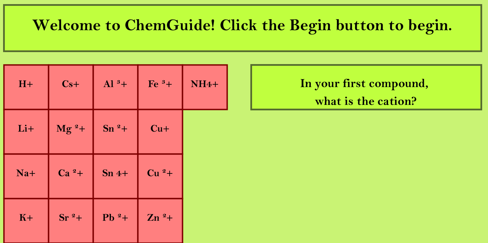

# Learning-App-2021
ChemGuide allows the user to balance chemical reactions. The user selects the ions in the reaction they need to balance, and the computer will automatically balance it for them.

